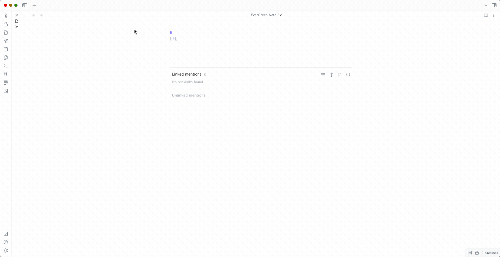

# Obsidian "EverGreen" Plugin

[EverGreen](https://notes.andymatuschak.org/) workflow with stack tabs in Obsidian 

## Support Obsidian version

\>= 1.0.0

## Install
go to release page.
download the zip, and unzip to your {vault}.obsidian/plugins

## How to use

1. enable this plugin 
2. (optional) enable `Stack tabs` would be more like andy's evergreen note workflow. Suits yourself.

## Feature

1 Open internal link in new tab;

2 ~~Reuse already opened tab if possible;~~  Follow the oepn stack

3 Keep only leaf to parent full tab history from link hierarchy, otherwise tab would be deleted;

Ex: Suppose you have these files in link:

A
  - B
    - C
    - D
      - H
      - C
    - E
  - F
    - G

 

plugin inspired by: [No Dupe Leaves](https://github.com/scambier/obsidian-no-dupe-leaves)

 

